#  Лабораторная работа № 2 — Введение в WordPress

> **Дисциплина:** Веб-технологии  
> **Цель:** Установить WordPress локально, познакомиться с панелью администрирования, темами и плагинами

---

##  Содержание

1. [Цель работы](#цель-работы)
2. [Шаг 1 — Подготовка среды](#шаг-1--подготовка-среды)
3. [Шаг 2 — Установка WordPress](#шаг-2--установка-wordpress)
4. [Шаг 3 — Начальные настройки](#шаг-3--начальные-настройки)
5. [Шаг 4 — Работа с темами](#шаг-4--работа-с-темами)
6. [Шаг 5 — Работа с плагинами](#шаг-5--работа-с-плагинами)
7. [Шаг 6 — Создание контента](#шаг-6--создание-контента)
8. [Ответы на контрольные вопросы](#ответы-на-контрольные-вопросы)
9. [Выводы](#выводы)

---

## Цель работы

Научиться устанавливать WordPress в локальной среде, ознакомиться с панелью администрирования, изменять внешний вид сайта с помощью тем и расширять функциональность с помощью плагинов.

---

## Шаг 1 — Подготовка среды

### 1.1. Установка XAMPP

Для создания локального сервера использовался пакет **XAMPP**, который включает:

| Компонент | Назначение |
|-----------|------------|
| Apache    | Веб-сервер |
| MySQL     | База данных |
| PHP       | Интерпретатор |
| phpMyAdmin | Управление БД через браузер |

**Установка:**
1. Скачать XAMPP с [apachefriends.org](https://www.apachefriends.org/)
2. Запустить установщик и следовать инструкциям
3. После установки запустить **XAMPP Control Panel**

### 1.2. Запуск модулей

В XAMPP Control Panel запущены модули **Apache** и **MySQL**.

```
Apache   [Start] → Running (порт 80)
MySQL    [Start] → Running (порт 3306)
```

Проверка: открыть `http://localhost` — должна отобразиться стартовая страница XAMPP.

>  **Рисунок 1.** Панель управления XAMPP с запущенными модулями

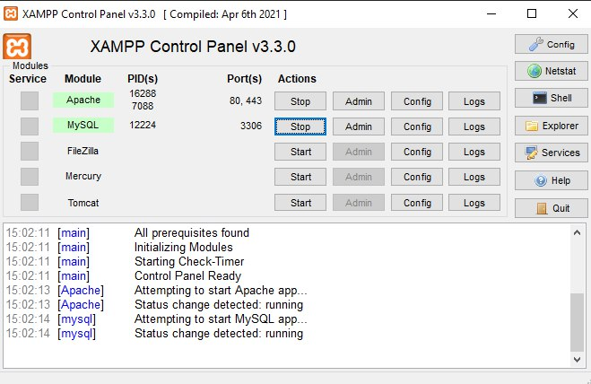

### 1.3. Создание базы данных

В `http://localhost/phpmyadmin`:

1. Перейти в раздел **Databases**
2. В поле «Create database» ввести `wp_lab2`
3. Выбрать кодировку `utf8mb4_unicode_ci`
4. Нажать **Create**

>  **Рисунок 2.** Создание базы данных `wp_lab2` в phpMyAdmin

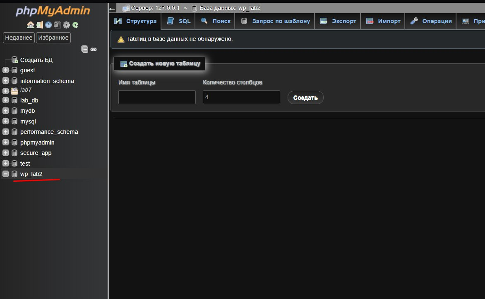

---

## Шаг 2 — Установка WordPress

### 2.1. Загрузка и распаковка

1. Скачать WordPress с [wordpress.org](https://wordpress.org/download/)
2. Распаковать архив в папку `C:\xampp\htdocs\wp_lab2\`

```
htdocs/
└── wp_lab2/
    ├── wp-admin/
    ├── wp-content/
    ├── wp-includes/
    ├── wp-config-sample.php
    └── index.php
```

### 2.2. Установка через браузер

Открыть `http://localhost/wp_lab2` и пройти мастер установки:

**Шаг 1 — Выбор языка:** выбрать нужный язык интерфейса.

**Шаг 2 — Параметры подключения к БД:**

| Поле | Значение |
|------|----------|
| Database Name | `wp_lab2` |
| Username | `root` |
| Password | _(пустое — стандарт XAMPP)_ |
| Database Host | `localhost` |
| Table Prefix | `wp_` |

**Шаг 3 — Данные сайта:**

| Поле | Значение |
|------|----------|
| Site Title | wp_lab |
| Username | admin |
| Password | _(надёжный пароль)_ |
| Email | Anatolie9001@email.com |

**Шаг 4 — Завершение:** нажать **Install WordPress**.

> **Рисунок 3.** Финальный экран успешной установки WordPress

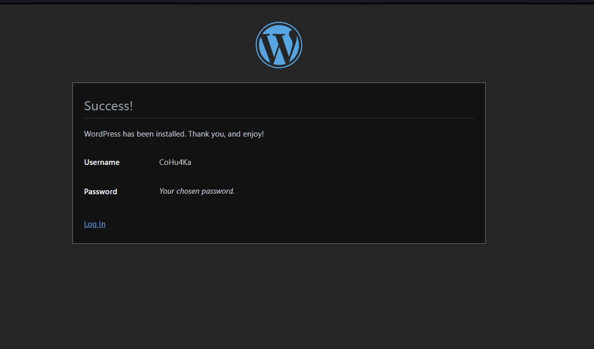

> **Рисунок 4.** Главная страница панели администрирования (Dashboard)

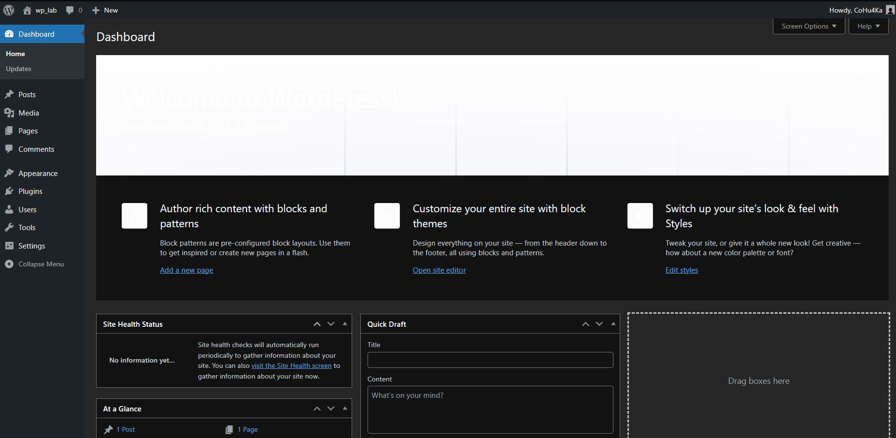

---

## Шаг 3 — Начальные настройки

### 3.1. Общие настройки (Settings → General)

Изменены параметры:

- **Site Title:** `wp_lab`
- **Tagline:** `Лабораторная работа по WordPress`
- **Timezone:** `UTC+2`

>  **Рисунок 5.** Настройки в разделе Settings → General

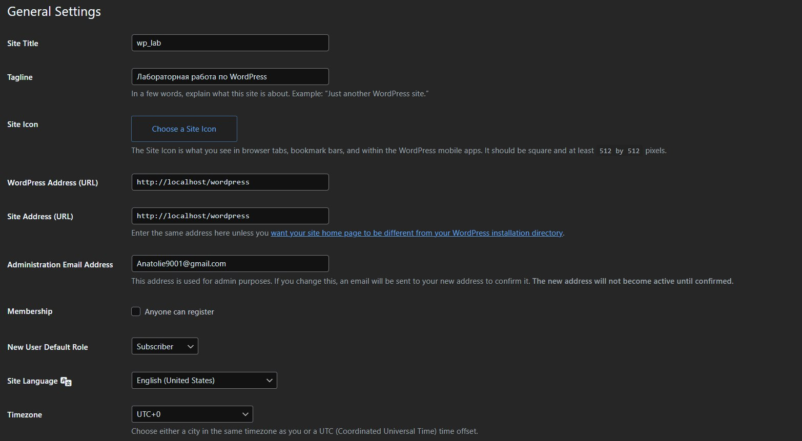

### 3.2. Постоянные ссылки (Settings → Permalinks)

Выбрана опция **Post name** — формирует URL вида `/название-записи/` вместо `/?p=123`.

**Почему это важно:**
- URL понятен пользователю
- Положительно влияет на SEO
- Удобно для навигации

>  **Рисунок 6.** Настройка постоянных ссылок — выбор «Post name»

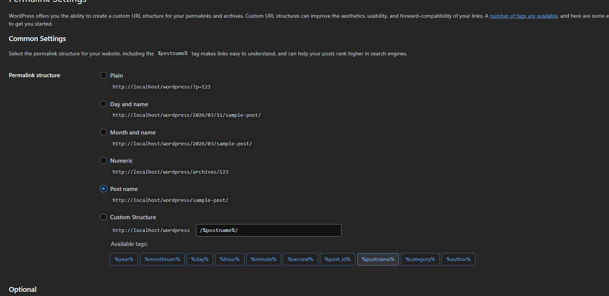

---

## Шаг 4 — Работа с темами

### 4.1. Установка темы Astra

Путь: **Appearance → Themes → Add New**

1. В поиске ввести «Astra»
2. Навести курсор на тему — нажать **Install**
3. После установки — нажать **Activate**

**Почему Astra:**
- Одна из самых популярных тем (1 млн+ активных установок)
- Высокая скорость загрузки
- Совместимость с большинством плагинов

>  **Рисунок 7.** Установка темы Astra из каталога WordPress

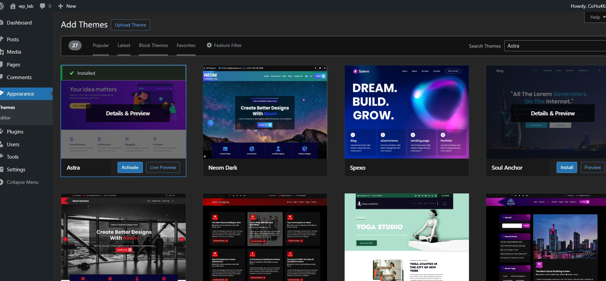

>  **Рисунок 8.** Сравнение внешнего вида сайта до и после смены темы

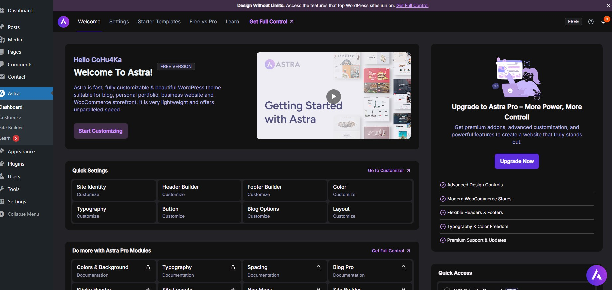

### 4.2. Кастомизация темы (Appearance → Customize)

Настроенные параметры:

| Раздел | Параметр | Значение |
|--------|----------|----------|
| Site Identity | Logo | Загружен файл logo.png |
| Site Identity | Site Title | Мой учебный сайт |
| Site Identity | Tagline | Лабораторная работа |
| Colors | Primary Color | `#2271b1` |
| Colors | Accent Color | `#1e4d78` |

>  **Рисунок 9.** Настройка логотипа и цветов через Customizer


---

## Шаг 5 — Работа с плагинами

### 5.1. Установка Classic Editor

Путь: **Plugins → Add New → поиск «Classic Editor»**

1. Найти плагин **Classic Editor** (автор: WordPress Contributors)
2. Нажать **Install Now** → **Activate**

**Результат:** При создании записей редактор Gutenberg заменяется на классический WYSIWYG-редактор.

>  **Рисунок 10.** Интерфейс Classic Editor при создании новой записи

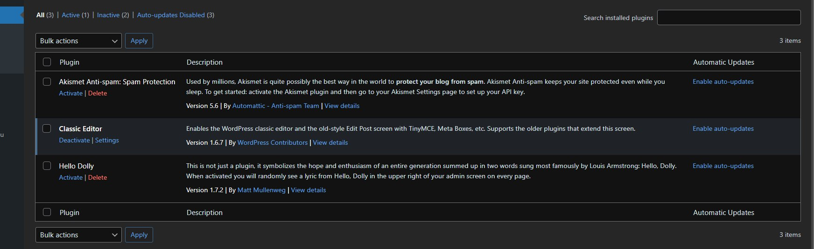

### 5.2. Установка Contact Form 7

Путь: **Plugins → Add New → поиск «Contact Form 7»**

1. Найти плагин **Contact Form 7** (автор: Takayuki Miyoshi)
2. Нажать **Install Now** → **Activate**

**После активации:**
- В боковом меню появился раздел **Contact**
- Автоматически создана форма по умолчанию
- Доступен шорткод для вставки формы на страницу

```
[contact-form-7 id="XXXXX" title="Contact form 1"]
```

>  **Рисунок 11.** Редактор Contact Form 7 с настройкой полей

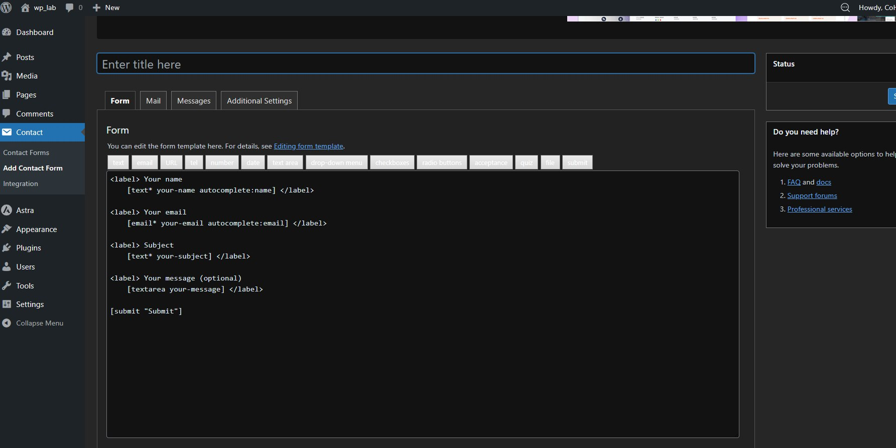

### 5.3. Деактивация плагина

В разделе **Plugins → Installed Plugins** плагин **Classic Editor** был деактивирован.

**Результат:** При создании записей снова отображается стандартный редактор Gutenberg — функциональность плагина исчезла.

>  **Рисунок 12.** Список установленных плагинов, Classic Editor деактивирован


---

## Шаг 6 — Создание контента

### 6.1. Страница «Контакты»

Путь: **Pages → Add New**

1. Заголовок: `Контакты`
2. В тело страницы вставлен шорткод формы Contact Form 7
3. Нажать **Publish**

>  **Рисунок 13.** Страница «Контакты» с формой обратной связи


### 6.2. Записи блога

Созданы три записи (Posts → Add New):

**Запись 1 — «Добро пожаловать»**
- Текстовый контент с форматированием (заголовки H2, H3, жирный текст, списки)
- Добавлена рубрика: «Общее»

**Запись 2 — «Технологии и разработка»**
- Изображение, загруженное через медиабиблиотеку
- Текст с описанием технологий

**Запись 3 — «Полезные ресурсы»**
- Список ссылок на ресурсы по WordPress
- Краткое описание каждого ресурса

>  **Рисунок 14.** Список записей блога в панели администрирования

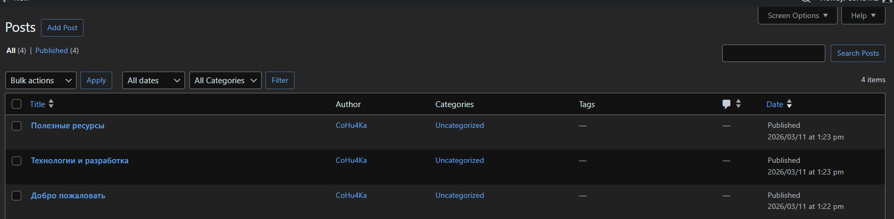

>  **Рисунок 15.** Отображение записи на сайте с темой Astra

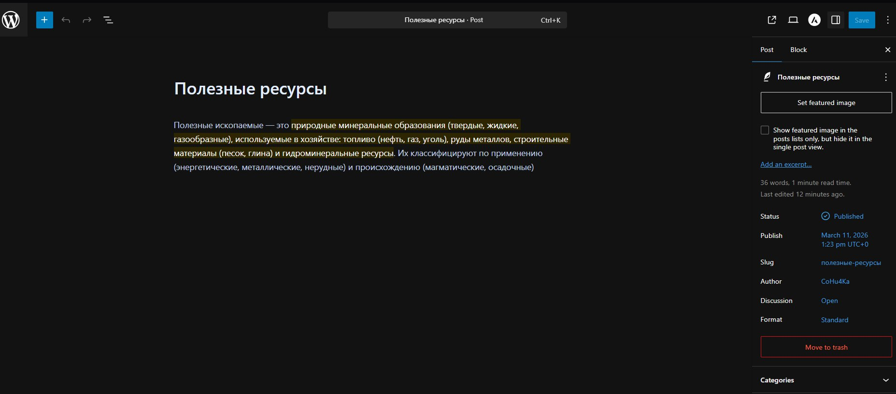

---

## Ответы на контрольные вопросы

###  Вопрос 1: Что делает тема в WordPress и что делает плагин?

**Тема** отвечает за **визуальное оформление** сайта:
- Внешний вид страниц (цвета, шрифты, макет)
- Расположение элементов (шапка, подвал, боковая панель)
- HTML/CSS структуру страниц

Тема **не хранит** контент и не влияет на функциональность сайта.

**Плагин** расширяет **функциональность** WordPress:
- Добавляет новые возможности (формы, галереи, SEO-инструменты)
- Изменяет поведение существующих функций
- Интегрирует сайт со сторонними сервисами

Плагины работают **независимо от темы**.

>  **Аналогия:** Тема — это дизайн автомобиля (кузов, цвет, интерьер). Плагин — это дополнительное оборудование (навигатор, парктроник, люк).

---

###  Вопрос 2: Почему при смене темы контент сайта не теряется?

WordPress использует **принцип разделения данных и представления (MVC)**:

```
┌─────────────────────────────────────────────┐
│              База данных MySQL              │
│  (записи, страницы, медиафайлы, настройки)  │
└─────────────────────────────────────────────┘
                       ↕
┌─────────────────────────────────────────────┐
│              WordPress Core                 │
│        (логика обработки запросов)          │
└─────────────────────────────────────────────┘
                       ↕
┌─────────────────────────────────────────────┐
│                   Тема                      │
│  (шаблоны отображения: PHP + CSS + JS)      │
└─────────────────────────────────────────────┘
```

**Контент** (тексты, изображения, настройки) хранится в **базе данных**.  
**Тема** содержит только **шаблоны** — инструкции по отображению этих данных.

При смене темы WordPress просто начинает использовать новые шаблоны для отображения **тех же данных**. База данных не затрагивается.

---

###  Вопрос 3: Как изменить внешний вид сайта без редактирования кода?

WordPress предоставляет несколько встроенных инструментов:

| Инструмент | Что позволяет сделать |
|------------|----------------------|
| **Appearance → Themes** | Сменить тему целиком |
| **Appearance → Customize** | Изменить логотип, цвета, шрифты, фон в реальном времени |
| **Appearance → Menus** | Создать и настроить навигационные меню |
| **Appearance → Widgets** | Добавить виджеты в сайдбар и подвал |
| **Блочный редактор Gutenberg** | Создавать сложные макеты страниц через блоки |

**Дополнительно — через плагины:**

- **Elementor / WPBakery** — визуальные конструкторы страниц (drag & drop)
- **Customizer плагины** — расширяют возможности стандартного Customizer

---

## Выводы

В ходе выполнения лабораторной работы:

- ✅ Развёрнута локальная установка WordPress с использованием стека XAMPP
- ✅ Изучены основные разделы панели администрирования
- ✅ Установлена и настроена тема **Astra** через Customizer
- ✅ Установлены и протестированы плагины **Classic Editor** и **Contact Form 7**
- ✅ Создана страница «Контакты» с формой обратной связи
- ✅ Созданы три записи блога с различным контентом
- ✅ Проверен механизм деактивации плагинов

Выполненная работа сформировала базовое понимание архитектуры WordPress: разделение контента, представления и функциональности позволяет гибко управлять сайтом без знания программирования.

---

##  Структура репозитория

```
lab2-wordpress/
├── README.md              ← этот файл (отчёт)
├── screenshots/           ← скриншоты этапов работы
│   ├── 01-xampp-control-panel.jpg
│   ├── 02-phpmyadmin-create-db.jpg
│   ├── 03-wordpress-installed.jpg
│   ├── 04-wordpress-dashboard.jpg
│   ├── 05-settings-general.jpg
│   ├── 06-settings-permalinks.jpg
│   ├── 07-install-theme-astra.jpg
│   ├── 08-theme-before-after.jpg
│   ├── 09-theme-customizer.jpg
│   ├── 10-classic-editor.jpg
│   ├── 11-contact-form-7.jpg
│   ├── 12-plugins-list.jpg
│   ├── 13-contacts-page.jpg
│   ├── 14-posts-list.jpg
│   └── 15-post-frontend.jpg
└── wp-config-sample.md    ← пример конфигурации (без паролей)
```

---

##  Технические требования

- XAMPP 8.x (Apache + MySQL + PHP 8.x)
- WordPress 6.x
- Браузер: Chrome / Firefox / Edge

---

*Лабораторная работа № 2 | Введение в WordPress*
